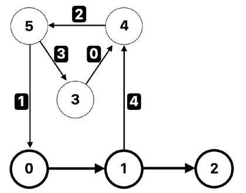

# Game

After discovering $n$ planets, numbered from $0$ to $n-1$, the Pharaohs have started to build a transportation system between them by **one-way teleporters**.
Each teleporter has a starting planet and an ending planet.
When a tourist uses a teleporter in the starting planet, the tourist is teleported to the ending planet.
Note that the starting and ending planet of a teleporter may be the same.
A teleporter with its starting planet $u$ and ending planet $v$ is denoted by $(u,v)$.

To encourage widespread use of the teleportation system, the Pharaohs have created a game that can be played by tourists while travelling with the transportation system.
A tourist can start the game from any planet.
The planets $0, 1, \ldots, k-1$ ($k \leq n$) are called **special planets**.
Every time a tourist enters a special planet, the tourist gets an stamp.

Currently, for each $i$ ($0 \leq i \leq k-2$), there is a teleporter $(i, i+1)$.
These $k-1$ teleporters are called **starting teleporters**.

New teleporters are added one by one.
As new teleporters are added, it may become possible for a tourist to get infinite number of stamps.
To be precise, this happens when there is a sequence of planets
$w[0], w[1], \ldots, w[t]$ satisfying the following conditions:

- $1 \leq t$
- $0 \leq w[0] \leq k-1$
- $w[t] = w[0]$
- For each $i$ ($0 \leq i \leq t-1$), there is a teleporter $(w[i], w[i+1])$.

Note that a tourist can use starting teleporters and **any** teleporters that have been added so far.

Your task is to help the Pharaohs verify, after the addition of each teleporter,
whether a tourist can get infinite number of stamps or not.

## Implementation details

You should implement the following procedures:

```
init(int n, int k)
```

- $n$: the number of planets.
- $k$: the number of special planets.
- This procedure is called exactly once, before any calls to `add_teleporter`.


```
int add_teleporter(int u, int v)
```

- $u$ and $v$: the starting and the ending planet of the added teleporter.
- This function is called at most $m$ times (for the value of $m$, see Constraints).
- This function should return $1$ if, after the teleporter $(u,v)$ is added, the tourist can get infinite number of stamps. Otherwise, this function should return $0$.
- Once this function returns $1$, your program will be terminated.

## Examples

### Example 1

Consider the following call:

```
init(6, 3)
```

In this example, there are $6$ planets and $3$ special planets.
The planets $0$, $1$, and $2$ are special planets.
The starting teleporters are $(0, 1)$ and $(1, 2)$.

Suppose that the grader calls:

- (0) `add_teleporter(3, 4)`: You should return $0$.
- (1) `add_teleporter(5, 0)`: You should return $0$.
- (2) `add_teleporter(4, 5)`: You should return $0$.
- (3) `add_teleporter(5, 3)`: You should return $0$.
- (4) `add_teleporter(1, 4)`: At this point it is possible to get infinite number of stamps. For example, the tourist starts in the planet $0$, goes to the planets $1, 4, 5, 0, 1, 4, 5, 0, \ldots$ in this order. Hence, you should return $1$, and your program will be terminated.

The following figure illustrates this example.
The special planets and the starting teleporters are shown in bold.
Teleporters added by `add_teleporter` are labeled from $0$ through $4$, in order.


### Example 2

Consider the following call:

```
init(4, 2)
```

In this example, there are $4$ planets and $2$ special planets.
The planets $0$ and $1$ are special planets.
The starting teleporter is $(0, 1)$.

Suppose that the grader calls:

- `add_teleporter(1, 1)`: after adding the teleporter $(1,1)$, it is possible to get infinite number of stamps. For example, the tourist starts in the planet $1$, and enters the planet $1$ infinitely many times using the teleporter $(1,1)$. Hence, you should return $1$, and your program will be terminated.

Another sample input/output is also available in the attachment package.

## Constraints

- $1 \leq n \leq 300\,000$
- $1 \leq m \leq 500\,000$
- $1 \leq k \leq n$

For each call to the `add_teleporter` procedure:
- $0 \leq u \leq n-1$ and $0 \leq v \leq n-1$
- There is no teleporter from the planet $u$ to the planet $v$ before adding the teleporter $(u,v)$.

## Subtasks

1. (2 points) $n = k$, $n \leq 100$, $m \le 300$
2. (10 points) $n \leq 100$, $m \le 300$
3. (18 points) $n \leq 1\,000$, $m \leq 5\,000$
4. (30 points) $n \leq 30\,000$, $m \leq 50\,000$, $k \leq 1\,000$
5. (40 points) No additional constraints

## Sample grader

The sample grader reads the input in the following format:

- line $1$: $\,\, n\,m\,k$
- line $2 + i$ ($0 \leq i \leq m-1$): $\,\, u[i]\,v[i]$

The sample grader first calls `init`, and then `add_teleporter` for $u = u[i]$ and $v = v[i]$ for $i = 0, 1,\ldots,m-1$ in order.

It prints the index of the first call to `add_teleporter` which returns $1$ (which is between $0$ and $m-1$, inclusive), or $m$ if all calls to `add_teleporter` return $0$.

If some call to `add_teleporter` returns an integer other than $0$ or $1$, the sample grader prints $-1$ and your program is terminated immediately.# Game

After discovering $N$ planets, numbered from $0$ to $N-1$, Pharaos has started to build a transportation system between them by **one-way teleporters**.
Each teleporter has a starting planet and an ending planet.
When a tourist uses a teleporter in the starting planet, the tourist is teleported and enters the ending planet.
Note that the starting and ending planet of a teleporter may be the same.
A teleporter with its starting planet $u$ and ending planet $v$ is denoted by $(u,v)$.

To encourage widespread use of the teleportation system, Pharaos has created a game that can be played by tourists travelling from planet to planet with the transportation system.
A tourist can start the game from any planet.
The planets $0, 1, \ldots, K-1$ ($K \leq N$) are called **special planets**.
Every time a tourist enters a special planet, the tourist gets an stamp.

Currently, for each $i$ ($0 \leq i \leq K-2$), there is a teleporter $(i, i+1)$.
These $K-1$ teleporters are called **starting teleporters**.

New teleporters are added one by one.
As new teleporters are added, it may become possible for a tourist to get infinite number of stamps.
To be precise, this happens when there is a sequence of planets
$w\_0, w\_1, \ldots, w\_t$ satisfying the following conditions:

- $1 \leq t$
- $0 \leq w\_0 \leq K-1$
- $w\_t = w\_0$
- For each $i$ ($0 \leq i \leq t-1$), there is a teleporter $(w\_i, w\_{i+1})$.

Note that a tourist can use starting teleporters and **any** teleporters that have been added so far.

Your task is to help Pharaos verify, after the addition of each teleporter,
whether a tourist can get infinite number of stamps or not.

## Implementation details

You should implement the following procedure and function:

```
init(int N, int K)
```

- `N`: the number of planets.
- `K`: the number of special planets.
- This procedure is called exactly once, before any calls to `add_teleporter`.


The following function is called for each teleporter addition.

```
int add_teleporter(int u, int v)
```

- `u` and `v`: the starting and the ending planet of the added teleporter.
- This function is called at most $M$ times (for the value of $M$, see Constraints).
- This function should return $1$ if, after the teleporter $(u,v)$ is added, the tourist can get infinite number of stamps. Otherwise, this function should return $0$.
- Once this function returns $1$, your program will be terminated.

## Examples

### Example 1

Let $N = 6$ and $K = 3$.

The grader first calls `init(6, 3)`.

In this example, there are $6$ planets and $3$ special planets.
The planets $0$, $1$, and $2$ are special planets.
The starting teleporters are $(0, 1)$ and $(1, 2)$.

Suppose that the grader calls:

- (0) `add_teleporter(3, 4)`: You should return $0$.
- (1) `add_teleporter(5, 0)`: You should return $0$.
- (2) `add_teleporter(4, 5)`: You should return $0$.
- (3) `add_teleporter(5, 3)`: You should return $0$.
- (4) `add_teleporter(1, 4)`: At this point it is possible to get infinite number of stamps. For example, the tourist starts in the planet $0$, goes to the planets $1, 4, 5, 0, 1, 4, 5, 0, \ldots$ in this order. Hence, you should return $1$, and your program will be terminated.

The following figure illustrates this example.
The special planets and the starting teleporters are shown in bold.
Teleporters added by `add_teleporter` are labeled from $0$ through $4$, in order.



The file `sample-01-in.txt` in the zipped attachment package corresponds to this example.

### Example 2

Let $N = 4$ and $K = 2$.

The grader first calls `init(4, 2)`.

In this example, there are $4$ planets and $2$ special planets.
The planets $0$ and $1$ are special planets.
The starting teleporter is $(0, 1)$.

Suppose that the grader calls:

- `add_teleporter(1, 1)`: after adding the teleporter $(1,1)$, it is possible to get infinite number of stamps. For example, the tourist starts in the planet $1$, and enters the planet $1$ infinitely many times using the teleporter $(1,1)$. Hence, you should return $1$, and your program will be terminated.

The file `sample-02-in.txt` in the zipped attachment package corresponds to this example.

Another sample input/output are also available in the package.

## Constraints

- $1 \leq N \leq 300\,000$
- $1 \leq M \leq 500\,000$
- $1 \leq K \leq N$
- $0 \leq u \leq N-1$ and $0 \leq v \leq N-1$ for any call to `add_teleporter`.
For any call to `add_teleporter`, there is no teleporter from the room $u$ to the planet $v$ before adding the teleporter $(u,v)$.

## Subtasks

1. (2 points) $N = K$, $N \leq 100$, $M \le 300$
2. (10 points) $N \leq 100$, $M \le 300$
3. (18 points) $N \leq 1\,000$, $M \leq 5\,000$
4. (30 points) $N \leq 30\,000$, $M \leq 50\,000$, $K \leq 1\,000$
5. (40 points) No additional constraints

## Sample grader

The sample grader reads the input in the following format:

- line $1$: $N$ $M$ $K$
- line $2 + i$ ($0 \leq i \leq M-1$): $u_i$ $v_i$

The sample grader first calls `init`, and then `add_teleporter` for $u = u_i$ and $v = v_i$ for $i = 0, 1,\ldots,M-1$ in order.

It prints the index of the first call to `add_teleporter` which returns $1$ (which is between $0$ and $M-1$, inclusive), or $M$ if all calls to `add_teleporter` return $0$.

If some call to `add_teleporter` returns an integer other than $0$ or $1$, the sample grader prints $-1$ and your program is terminated immediately.
