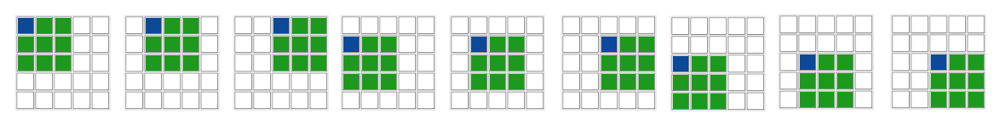

# Mars

It's well known that the Pharaohs were the first to reach outer space. They launched the first spaceship to set foot on the planet Thutmus I (commonly known as Mars nowadays). The surface of the planet can be modeled as a $(2n + 1) \times (2n + 1)$ grid of square cells with each cell containing either land or water. The state of the cell located in the $i$-th row and $j$-th column ($0 \le i,j \le 2 \cdot n$) is denoted by $s[i][j] = $'`1`' if it contains land, and $s[i][j] = $'`0`' if it contains water. 

Two land cells are said to be connected if there is a path consisting of land cells between them with every two consecutive cells sharing an edge. An island on the planet is defined as a maximal set of land cells such that every two cells of the set are connected.

The spaceship's mission was to count the number of islands on the planet. However, the task was not easy due to the spaceship's ancient computer. The computer had a memory $h$ which stored data in the form of a two-dimensional array of size $(2n + 1) \times (2n + 1)$ where each element of the array can store a binary string of length $100$ where each character is either `'0'` (ASCII 48) or `'1'` (ASCII 49). Initially, the first bit of each memory cell stores the state of each cell of the grid, $h[i][j][0] = s[i][j]$ (for all $0 \le i,j \le 2 \cdot n$). All other bits of $h$ are initially `'0'` (ASCII 48).

To process the data stored in the memory, the computer can only access a $3 \times 3$ portion of the memory and overwrite the value at the top-left cell of that portion. More formally, the computer can access the values at $h[i..i+2][j..j+2]$ ($0 \le i,j \le 2 \cdot (n - 1)$) and overwrite the value at $h[i][j]$. This process will later be referred to as **process cell $(i,j)$**.

Coping with the computer's limitations, the Pharaohs devised the following mechanism:
* The computer will process the memory through $n$ phases.
* In phase $k$ $(0 \le k \le n-1)$, let $m = 2 \cdot (n-k-1)$, the computer will process cell $(i,j)$ for all $0 \le i,j \le m$, in increasing order of $i$, and for each $i$, in increasing order of $j$. In other words, the computer will process the cells in the following order: $(0,0),(0,1),\cdots,(0,m)$, $(1,0),(1,1),\cdots,(1,m),\cdots,(m,0),(m,1),\cdots,(m,m)$.
* In the last phase ($k = n-1$), the computer will only process cell $(0,0)$. After which, the value written at $h[0][0]$ should be equal to the number of islands on the planet in binary where the least significant bit in the number is store in the first character of the string.

The diagram below shows how the computer processes a memory of size $5 \times 5$ ($n = 2$). The blue cell demonstrates the cell being overwritten, and the colored cells demonstrate the subarray being processed.

During phase $0$, the computer will process the below subarrays in the following order:

During phase $1$, the computer will process only one subarray:


Your task is to implement a method that will allow the computer to calculate the number of islands on the planet Thutmus I given the way it operates.

## Implementation details

You should implement the following procedure:

```
string process(string[][] a, int i, int j, int k, int n)
```

* $a$: a $3 \times 3$ array denoting the subarray being processed, in particular, $a = h[i..i+2][j..j+2]$, Where each element of $a$ is a string of length exactly $100$ and each character will be either `'0'` (ASCII 48) or `'1'` (ASCII 49).
* $i,j$: the row and column number of the cell the computer is currently processing. 
* $k$: the current phase number.
* $n$: the total number of phases, and the dimensions of the planet's surface which consists of $(2n+1) \times (2n+1)$ cells.
* This procedure should return a binary string of length $100$. The returned value will be stored in the computer's memory at $h[i][j]$.
* The last call to this procedure will occur when $k = n-1$. During this call, the procedure should return the number of islands on the planet in binary representation where the least significant bit is represented by the character at index $0$ (the first character of the string) and the second least significant bit is at index $1$ and so on.
* This procedure must be independent of any static or global variables, and its return value should only depend on the parameters passed to it.

Each test case involves $T$ independent scenarios (i.e., different planets' surfaces). The behavior of your implementation for each scenario must be independent of the order of the scenarios, as the calls to the `process` procedure for each scenario might not happen consecutively. However, it's guaranteed that for each scenario, the `process` calls occur in the sequence specified in the statement.

Additionally, for each test case, a number of instances of your program will be started simultaneously. The memory and CPU time limits are for all these instances combined. Any deliberate attempt to pass data out-of-band between these instances is considered cheating and will be cause for disqualification.

In particular, any information saved to static or global variables during a call to the `process` procedure is not guaranteed to be available within the next procedure calls.

## Constraints

* $1 \le T \le 10$
* $1 \le n \le 20$
* $s[i][j]$ is either '`0`'(ASCII 48) or '`1`'(ASCII 49) (for all $0 \leq i,j \le 2 \cdot n$)
* Length of $h[i][j]$ is exactly $100$ (for all $0 \leq i,j \le 2 \cdot n$)
* Each character of $h[i][j]$ is either `'0'` (ASCII 48) or `'1'` (ASCII 49) (for all $0 \leq i,j \le 2 \cdot n$)

For each call to the `process` procedure:
* $0 \le k \le n-1$
* $0 \leq i,j \le 2\cdot (n-k-1)$

## Subtasks
1. (6 points) $n \leq 2$
2. (8 points) $n \leq 4$
3. (7 points) $n \leq 6$
4. (8 points) $n \leq 8$
5. (7 points) $n \leq 10$
6. (8 points) $n \leq 12$
7. (10 points) $n \leq 14$
8. (24 points) $n \leq 16$
9. (11 points) $n \leq 18$
10. (11 points) $n \leq 20$


## Examples

### Example 1

Consider the case where $n = 1$ and $s$ is as follows:
```
'1' '0' '0'
'1' '1' '0'
'0' '0' '1'
```
In this example, the planet's surface consists of $3 \times 3$ cells and $2$ islands. There will be only $1$ phase of calls to the `process` procedure.

During phase $0$, the grader will call the `process` procedure exactly once:
```
process([["100","000","000"],["100","100","000"],["000","000","100"]],0,0,0,1)
```

Notice that only the first 3 bits of each cell of $h$ are shown.

This procedure call should return `"0100..."` (the omitted bits are all zeros), where $....0010$ in binary equals $2$ in decimal. Note that there are 96 zeros omitted and replaced by `...`.

### Example 2

Conside the case where $n = 2$ and $s$ is as follows:
```
'1' '1' '0' '1' '1'
'1' '1' '0' '0' '0'
'1' '0' '1' '1' '1'
'0' '1' '0' '0' '0'
'0' '1' '1' '1' '1'
```
In this example, the planet's surface consists of $5 \times 5$ cells and $4$ islands. There will be $2$ phases of calls to the `process` procedure.

During phase $0$, the grader will call the `process` procedure $9$ times:

```
process([["100","100","000"],["100","100","000"],["100","000","100"]],0,0,0,2)
process([["100","000","100"],["100","000","000"],["000","100","100"]],0,1,0,2)
process([["000","100","100"],["000","000","000"],["100","100","100"]],0,2,0,2)
process([["100","100","000"],["100","000","100"],["000","100","000"]],1,0,0,2)
process([["100","000","000"],["000","100","100"],["100","000","000"]],1,1,0,2)
process([["000","000","000"],["100","100","100"],["000","000","000"]],1,2,0,2)
process([["100","000","100"],["000","100","000"],["000","100","100"]],2,0,0,2)
process([["000","100","100"],["100","000","000"],["100","100","100"]],2,1,0,2)
process([["100","100","100"],["000","000","000"],["100","100","100"]],2,2,0,2)
```

Let's assume the above calls returned the values `"011", "000", "000", "111", "111", "011", "110", "010", "111"` respectively where the omitted bits are zeros. So, after phase $0$ is finished, $h$ will be storing the following values:
```
"011", "000", "000", "100", "100"
"111", "111", "011", "000", "000"
"110", "010", "111", "100", "100"
"000", "100", "000", "000", "000"
"000", "100", "100", "100", "100"
```

During phase $1$, the grader will call the `process` procedure once:
```
process([["011","000","000"],["111","111","011"],["110","010","111"]],0,0,1,2)
```
Finaly, this procedure call should return `"0010000...."` (the omitted bits are all zeros), where $....0000100$ in binary equals $4$ in decimal. Note that there are 93 zeros omitted and replaced by `...`.

## Sample grader

The sample grader reads the input in the following format:
* line $1$: $\,\,T$
* block $i$ ($0 \le i \le T-1$): a block representing scenario $i$.
  - line $1$:  $\,\,n$
  - line $2+j$ ($0 \le j \leq 2 \cdot n$):  $\,\,s[j][0] \,\, s[j][1] \;\ldots\;  s[j][2 \cdot n]$

The sample grader prints the result in the following format:
* line $1+i$ ($0 \le i \le T-1$): the last return value of the `process` procedure for the $i$-th scenario in decimal.
